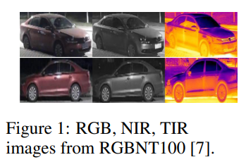
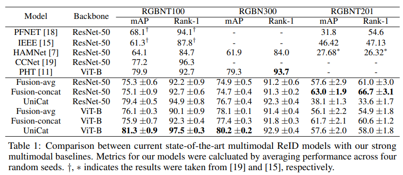
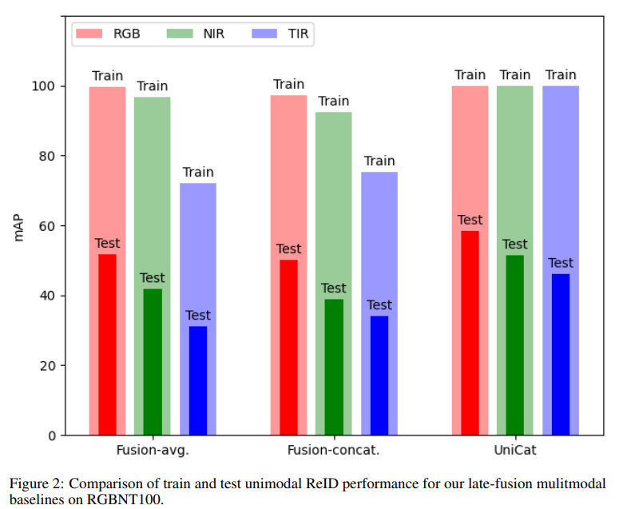

# [UniReps @ NeurIPS 2023] UniCat: Crafting a Stronger Fusion Baseline for Multimodal Re-Identification

The repository for  [UniCat: Crafting a Stronger Fusion Baseline for Multimodal Re-Identification](https://arxiv.org/pdf/2310.18812.pdf) achieves state-of-the-art performances on 3 commonly used multimodal ReID datasets RGBNT100, RGBN300, and RGBNT201. 


## Abstract
Multimodal Re-Identification (ReID) is a popular retrieval task that aims to reidentify objects across diverse data streams, prompting many researchers to integrate multiple modalities into a unified representation. While such fusion promises a holistic view, our investigations shed light on potential pitfalls. We uncover that prevailing late-fusion techniques often produce suboptimal latent representations when compared to methods that train modalities in isolation. We argue that this effect is largely due to the inadvertent relaxation of the training objectives on individual modalities when using fusion, what others have termed modality laziness. We present a nuanced point-of-view that this relaxation can lead to certain modalities failing to fully harness available task-relevant information, and yet, offers a protective veil to noisy modalities, preventing them from overfitting to taskirrelevant data. Our findings also show that unimodal concatenation (UniCat) and other late-fusion ensembling of unimodal backbones, when paired with best-known training techniques, exceed the current state-of-the-art performance across several multimodal ReID benchmarks. By unveiling the double-edged sword of "modality laziness", we motivate future research in balancing local modality strengths with global representations.

The following shows a sample of paired data from the RGBNT100 dataset: 



## Performance

Please see our paper for discussion on the noisy RGBNT201 dataset:



Further analyzing within each modality, we find that our method learns the most task-relevant information: 



## Training

We utilize 4 GPUs for training.

```bash
sh ./hpo.sh
```

## Evaluation

```bash
sh ./test.sh
```

## Acknowledgement

Codebase built off from [TransReID](https://github.com/damo-cv/TransReID)

